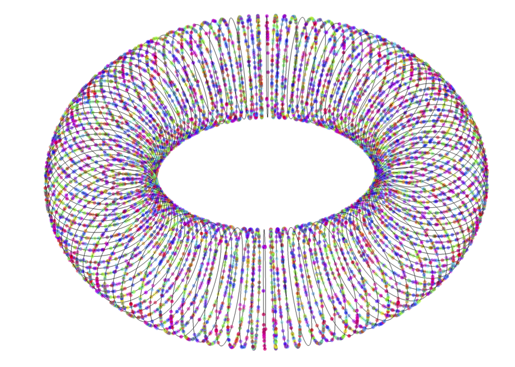

### Basic Math with BigQuery Remote Functions using Homomorphic Encryption 

Several [BigQuery Remote functions](https://cloud.google.com/bigquery/docs/reference/standard-sql/remote-functions) that'll let you perform some very basic math though [homomorphic encryption](https://en.wikipedia.org/wiki/Homomorphic_encryption)

From wikipedia:

_Homomorphic encryption is a form of encryption that permits users to perform computations on its encrypted data without first decrypting it. These resulting computations are left in an encrypted form which, when decrypted, result in an identical output to that produced had the operations been performed on the unencrypted data. Homomorphic encryption can be used for privacy-preserving outsourced storage and computation. This allows data to be encrypted and out-sourced to commercial cloud environments for processing, all while encrypted._

meaning Alice can encrypt some numbers, give it to Bob, he can perform some basic math on it _while its still under encryption_ and give Alice the result back which she can decrypt to see the result....

i can't emphasize how cool that is..the math is done data that is still encrypted: Bob has no idea what those numbers are but yet still did some operations against it...

If you're looking for an explanation on how FHE works...thats way beyond me..i'd encourage you to read  the excellent blog here:  [A Homomorphic Encryption Illustrated Primer](https://humanata.com/blog/illustrated_primer/)...which is also where i got the colorful picture.

In my case case, the FHE functions are implemented using [lattigo](https://github.com/tuneinsight/lattigo) as [BigQuery Remote Functions](https://cloud.google.com/bigquery/docs/reference/standard-sql/remote-functions) and can do some basic stuff:

* `encrypt(integer) --> bytes`
   Encrypt a number with a static public key encoded into the function

* `decrypt(bytes) --> bytes`
   Decrypts some FHE encrypted bytes using a secret key encoded into the function

* `add(x bytes, y bytes) --> bytes`
   Adds two FHE encrypted values

* `sub(x bytes, y bytes) --> bytes`
   Subtracts two FHE encrypted values

* `mul(x bytes, y bytes) --> bytes`
   Multiplies two FHE encrypted values

* `neg(x bytes) --> bytes`
   Negates an FHE encrypted value

Now..you maybe asking..thats it?  yeah pretty much...this has very little current practical value but I expect as this technology is developed, it'll be shattering..

is it efficient to use BQ like this?  nope, not in its current form...

{}
This is just for amusement..this has little practical value as far as i can tell...just enjoy
{}



### Setup

The instructions below will create the BQ Remote functions you can mix and match to do some path...

You can ofcourse create your own combined function (eg one function that does several operations eg, do N primitive operations in one remote functions)..but i've left that out for simplicity.

For examples about that, see

- [Simple math using WebAssembly and Homomorphic Encryption](https://blog.salrashid.dev/articles/2022/wasm_homomorphic_encryption/)
- [Simple RideSharing helloworld with Homomorphic Encryption](https://blog.salrashid.dev/articles/2020/fhe/)


```bash
export GCLOUD_USER=`gcloud config get-value core/account`
export PROJECT_ID=`gcloud config get-value core/project`
export PROJECT_NUMBER=`gcloud projects describe $PROJECT_ID --format='value(projectNumber)'`
```

Now lets create a bigquery table, encrypt two numbers using an FHE public key and then insert those encrypted numbers in:

I've provided the public and secret keys here already for you.  If you want to generate your own, the code is provided in `app/main.go`.

```golang
	pub, sec, err := genKey("pub.bin", "sec.bin")
	if err != nil {
		fmt.Printf("Err %v\n", err)
		return
	}
```

 Just uncomment it to generate your own keypair.  You'll need to add your new key into the code for the functions you'll use.  For now, just use my keys

```golang
const (
	pubKeyURL = "https://gist.githubusercontent.com/salrashid123/38389be8474f65275024ec79dec48948/raw/43c988b1ba7436999cc5c2cab5b278d9075a53b2/public.b64"
	secretKeyURL = "https://gist.githubusercontent.com/salrashid123/ef8e168fb868cc5f2783aff2051c63f4/raw/9f300f40c5071f0ea8732db9002ac5fe36d508df/sec.b64"
)
```


```bash
## crate the dataset
bq --location=US mk -d \
--description "FHE dataset." fhe

bq mk \
  -t \
  --description "FHE xy" \
  --label organization:fhexy \
  fhe.xy \
  uid:STRING,x:BYTES,y:BYTES

## insert the encrypted values into the dataset

cd app/
go run main.go --projectID $PROJECT_ID

# get the connection
bq mk --connection --display_name='myconn' --connection_type=CLOUD_RESOURCE \
        --project_id=$PROJECT_ID --location=US my-connection

bq show --location=US --connection  my-connection

export BQ_CONN_SVC_ACCOUNT=`bq show --format=json --location=US --connection  my-connection  | jq -r '.cloudResource.serviceAccountId'`
echo $BQ_CONN_SVC_ACCOUNT
```

---

### Load Keys as Secrets?

Normally, you would save the Public and Secret keys as environment variable based [Secrets](https://cloud.google.com/functions/docs/configuring/secrets) (well, not so much for the public key: that doesn't need to be a secret-secret)

Unfortunately, the maximum size of a Secret is  `65536 bytes` and our keys are too large...you can find ways around this but since this is just a demo, i'm gonna stuff it into the code directly..

### Encrypt

```bash
cd encrypt/

gcloud beta functions deploy fhe-encrypt  \
   --gen2   --runtime go116  --entry-point FHE_ENCRYPT \
   --region=us-central1   --trigger-http

# gcloud run deploy fhe-encrypt --source .  --no-allow-unauthenticated

export CLOUD_RUN_URL=`gcloud run services describe fhe-encrypt --format="value(status.address.url)"`
echo $CLOUD_RUN_URL

gcloud run services add-iam-policy-binding fhe-encrypt \
  --member="user:$GCLOUD_USER" \
  --role="roles/run.invoker"

gcloud run services add-iam-policy-binding fhe-encrypt \
  --member="serviceAccount:$BQ_CONN_SVC_ACCOUNT" \
  --role="roles/run.invoker"

## Remember to replace CLOUD_RUN_URL below 
bq --format=json query --dataset_id=$PROJECT_ID:fhe --location=US --nouse_legacy_sql  "
  CREATE OR REPLACE FUNCTION fhe_encrypt(x NUMERIC) RETURNS BYTES 
    REMOTE WITH CONNECTION \`$PROJECT_ID.us.my-connection\`
    OPTIONS (endpoint = '$CLOUD_RUN_URL',  user_defined_context = [('mode', 'encrypt')] )"

## test directly
curl -s  -X POST  \
  -H "Authorization: Bearer `gcloud auth print-identity-token`" \
  -H "Content-Type: application/json"  \
  -d @req_encrypt.json \
  "$CLOUD_RUN_URL" | jq '.'
```

The output of the curl command is just FHE encrypted bytes...

### Decrypt

```bash
cd decrypt/

gcloud beta functions deploy fhe-decrypt  \
   --gen2   --runtime go116  --entry-point FHE_DECRYPT \
   --region=us-central1   --trigger-http

# gcloud run deploy fhe-decrypt --source .   --no-allow-unauthenticated


export CLOUD_RUN_URL=`gcloud run services describe fhe-decrypt --format="value(status.address.url)"`
echo $CLOUD_RUN_URL

gcloud run services add-iam-policy-binding fhe-decrypt \
  --member="user:$GCLOUD_USER" \
  --role="roles/run.invoker"

gcloud run services add-iam-policy-binding fhe-decrypt \
  --member="serviceAccount:$BQ_CONN_SVC_ACCOUNT" \
  --role="roles/run.invoker"


 bq --format=json query --dataset_id=$PROJECT_ID:fhe --location=US --nouse_legacy_sql  "
  CREATE OR REPLACE FUNCTION fhe_decrypt(x BYTES) RETURNS BYTES 
    REMOTE WITH CONNECTION \`$PROJECT_ID.us.my-connection\`
    OPTIONS (endpoint = '$CLOUD_RUN_URL',  user_defined_context = [('mode', 'decrypt')] )"
```

### Add

```bash
cd add/

gcloud beta functions deploy fhe-add  \
   --gen2   --runtime go116  --entry-point FHE_ADD \
   --region=us-central1   --trigger-http

# gcloud run deploy fhe-add --source .  --no-allow-unauthenticated

export CLOUD_RUN_URL=`gcloud run services describe fhe-add --format="value(status.address.url)"`
echo $CLOUD_RUN_URL

gcloud run services add-iam-policy-binding fhe-add \
  --member="user:$GCLOUD_USER" \
  --role="roles/run.invoker"

gcloud run services add-iam-policy-binding fhe-add \
  --member="serviceAccount:$BQ_CONN_SVC_ACCOUNT" \
  --role="roles/run.invoker"

curl -s  -X POST  \
  -H "Authorization: Bearer `gcloud auth print-identity-token`" \
  -H "Content-Type: application/json"  \
  -d @req_add.json \
  "$CLOUD_RUN_URL" | jq '.'


 bq --format=json query --dataset_id=$PROJECT_ID:fhe --location=US --nouse_legacy_sql  "
  CREATE OR REPLACE FUNCTION fhe_add(x BYTES, y BYTES) RETURNS BYTES 
    REMOTE WITH CONNECTION \`$PROJECT_ID.us.my-connection\`
    OPTIONS (endpoint = '$CLOUD_RUN_URL',  user_defined_context = [('mode', 'add')] )"
```


### Sub


```bash
cd sub/

gcloud beta functions deploy fhe-sub  \
   --gen2   --runtime go116  --entry-point FHE_SUB \
   --region=us-central1   --trigger-http

# gcloud run deploy fhe-sub --source .  --no-allow-unauthenticated

export CLOUD_RUN_URL=`gcloud run services describe fhe-sub --format="value(status.address.url)"`
echo $CLOUD_RUN_URL

gcloud run services add-iam-policy-binding fhe-sub \
  --member="user:$GCLOUD_USER" \
  --role="roles/run.invoker"

gcloud run services add-iam-policy-binding fhe-sub \
  --member="serviceAccount:$BQ_CONN_SVC_ACCOUNT" \
  --role="roles/run.invoker"


bq --format=json query --dataset_id=$PROJECT_ID:fhe --location=US --nouse_legacy_sql  "
  CREATE OR REPLACE FUNCTION fhe_sub(x BYTES, y BYTES) RETURNS BYTES 
    REMOTE WITH CONNECTION \`$PROJECT_ID.us.my-connection\`
    OPTIONS (endpoint = '$CLOUD_RUN_URL',  user_defined_context = [('mode', 'sub')] )"
```

### Mul

```bash
cd mul/

gcloud beta functions deploy fhe-mul  \
   --gen2   --runtime go116  --entry-point FHE_MUL \
   --region=us-central1   --trigger-http

# gcloud run deploy fhe-mul --source .  --no-allow-unauthenticated

export CLOUD_RUN_URL=`gcloud run services describe fhe-mul --format="value(status.address.url)"`
echo $CLOUD_RUN_URL

gcloud run services add-iam-policy-binding fhe-mul \
  --member="user:$GCLOUD_USER" \
  --role="roles/run.invoker"

gcloud run services add-iam-policy-binding fhe-mul \
  --member="serviceAccount:$BQ_CONN_SVC_ACCOUNT" \
  --role="roles/run.invoker"


bq --format=json query --dataset_id=$PROJECT_ID:fhe --location=US --nouse_legacy_sql  "
  CREATE OR REPLACE FUNCTION fhe_mul(x BYTES, y BYTES) RETURNS BYTES 
    REMOTE WITH CONNECTION \`$PROJECT_ID.us.my-connection\`
    OPTIONS (endpoint = '$CLOUD_RUN_URL',  user_defined_context = [('mode', 'mul')] )"
```

### Neg

```bash
cd neg/

gcloud beta functions deploy fhe-neg  \
   --gen2   --runtime go116  --entry-point FHE_NEG \
   --region=us-central1   --trigger-http

# gcloud run deploy fhe-neg --source .  --no-allow-unauthenticated

export CLOUD_RUN_URL=`gcloud run services describe fhe-neg --format="value(status.address.url)"`
echo $CLOUD_RUN_URL

gcloud run services add-iam-policy-binding fhe-neg \
  --member="user:$GCLOUD_USER" \
  --role="roles/run.invoker"

gcloud run services add-iam-policy-binding fhe-neg \
  --member="serviceAccount:$BQ_CONN_SVC_ACCOUNT" \
  --role="roles/run.invoker"

bq --format=json query --dataset_id=$PROJECT_ID:fhe --location=US --nouse_legacy_sql  "
  CREATE OR REPLACE FUNCTION fhe_neg(x BYTES) RETURNS BYTES 
    REMOTE WITH CONNECTION \`$PROJECT_ID.us.my-connection\`
    OPTIONS (endpoint = '$CLOUD_RUN_URL',  user_defined_context = [('mode', 'neg')] )"
```

---

Now that all the functions are deployed, lets test some stuff


### View Encrypted columns

Remember we inserted encrypted data?  What to see a bit of it:

```bash
bq  query --use_legacy_sql=false  "SELECT 
 LEFT(ecd1.x,20) as x, 
 LEFT(ecd1.y,20) as y
FROM $PROJECT_ID.fhe.xy  AS ecd1"

+------------------------------+------------------------------+
|              x               |              y               |
+------------------------------+------------------------------+
| AgEMAgAAAELpoiEjAAAACHt5zGI= | AgEMAgAAAHvMYbbSAAAAOXwnE1w= |
+------------------------------+------------------------------+

```

thats right, x and y columns are encrypted forms of the integers we inserted

>> note, the FHE encrypted stuff is huuuuge...i'm only showing the first 20

### Encrypt

Encrypt two number...the same two numbers as in the code we used to insert the row `3,2`

```bash
bq  query --use_legacy_sql=false  "SELECT 
 LEFT(fhe.fhe_encrypt(3),20) as x, 
 LEFT(fhe.fhe_encrypt(2),20) as y"

+------------------------------+------------------------------+
|              x               |              y               |
+------------------------------+------------------------------+
| AgEMAgAAAFhwaC0JAAAAMHTHHAk= | AgEMAgAAADBFjOi9AAAAawFWgyg= |
+------------------------------+------------------------------+

```

### Encrypt/Decrypt

Run a cycle

```bash
bq  query --use_legacy_sql=false  "SELECT 
 SAFE_CONVERT_BYTES_TO_STRING(
   fhe.fhe_decrypt(
     fhe.fhe_encrypt(3)
   )
  ) as x, 
  SAFE_CONVERT_BYTES_TO_STRING(
    fhe.fhe_decrypt(
      fhe.fhe_encrypt(2)
    )
  ) as y"

+---+---+
| x | y |
+---+---+
| 3 | 2 |
+---+---+
```

### x+y

Let add those two encrypted values:

```bash
bq  query \
--use_legacy_sql=false  "SELECT 
  LEFT(fhe.fhe_add(ecd1.x, ecd1.y), 20) as add
FROM fhe.xy  AS ecd1"

+------------------------------+
|             add              |
+------------------------------+
| AgEMAgAAAD62BRf0AAAAQfeg374= |
+------------------------------+

```

>> the output is also encrypted!...at no time did the function `fhe_add` ever know what the numbers it added!!!


### decrypt(x+y)

Now lets use a function to decrypt the encrypted values above:

```bash
bq  query \
--use_legacy_sql=false  "SELECT 
  SAFE_CONVERT_BYTES_TO_STRING(
    fhe.fhe_decrypt(
      fhe.fhe_add( ecd1.x, ecd1.y )
    )
  ) as decrypt
FROM fhe.xy  AS ecd1"

+---------+
| decrypt |
+---------+
| 5       |
+---------+

```

we got `5`...that happens to be the sum of the two integers we inserted into BigQuery
```golang
	x := flag.Uint64("x", 3, "x")
	y := flag.Uint64("y", 2, "y")
```

 (um yeah, if it wasn't then the point of all this was for  you to [watch this](https://www.youtube.com/watch?v=oHg5SJYRHA0))


You can of course choose not to have a `fhe_decrypt()` and simply output the values of `fhe_add()` into some file or dataset and then do decrypt it offline..

### decrypt( encrypt(4) + encrypt(2) )

Now encrypt two values on the fly, add them while under encryption and then decrypt it

```bash
bq  query --use_legacy_sql=false  "SELECT 
  SAFE_CONVERT_BYTES_TO_STRING(
    fhe.fhe_decrypt(
      fhe.fhe_add(
        fhe.fhe_encrypt(4),
        fhe.fhe_encrypt(2)
      )
    )
  ) as add"

+-----+
| add |
+-----+
| 6   |
+-----+

```

### decrypt( -1 * encrypt(4) )

Pick a number, encrypt it, negate it and then decrypt it


```bash
bq  query --use_legacy_sql=false  "SELECT 
  SAFE_CONVERT_BYTES_TO_STRING(
    fhe.fhe_decrypt(
      fhe.fhe_neg(
        fhe.fhe_encrypt(4)
      )
    )
  ) as neg"

+-----+
| neg |
+-----+
| -4  |
+-----+

```

### decrypt( encrypt(4) * y )

Multiply two encrypted number and then decrypt it.  Note y is the entry that is already in BQ (`y=2`)

```bash
bq  query  --use_legacy_sql=false  "SELECT 
  SAFE_CONVERT_BYTES_TO_STRING(
    fhe.fhe_decrypt(
      fhe.fhe_mul(
        fhe.fhe_encrypt(4),
        ecd1.y
      )
    )
  ) as mul
  FROM fhe.xy  AS ecd1"

+-----+
| mul |
+-----+
| 8   |
+-----+

```

We can only mix and match here since the _same_ public key was used in the Remote function as was used when inserting the rows into BQ

### decrypt( ( encrypt(4) + x ) * y )

Add and Multiply where `(x,y)->(3,2)`

```bash
bq  query  --use_legacy_sql=false  "SELECT 
  SAFE_CONVERT_BYTES_TO_STRING(
    fhe.fhe_decrypt(
      fhe.fhe_mul(
        fhe.fhe_add(
          fhe.fhe_encrypt(4),
          ecd1.x
        ),
        ecd1.y
      )
    )
  ) as compound
  FROM fhe.xy  AS ecd1"

+----------+
| compound |
+----------+
| 14       |
+----------+

```

---

There it is..basic math..as for division..see [this](https://crypto.stackexchange.com/questions/53257/paillier-homomorphic-encryption-to-calculate-the-means) or [this](https://crypto.stackexchange.com/questions/65953/can-i-perform-a-division-of-two-integers-homomorphically-using-elgamal)...the math and understanding it way, way beyond me.


The whole intent of this article is academic and for some amusement...
